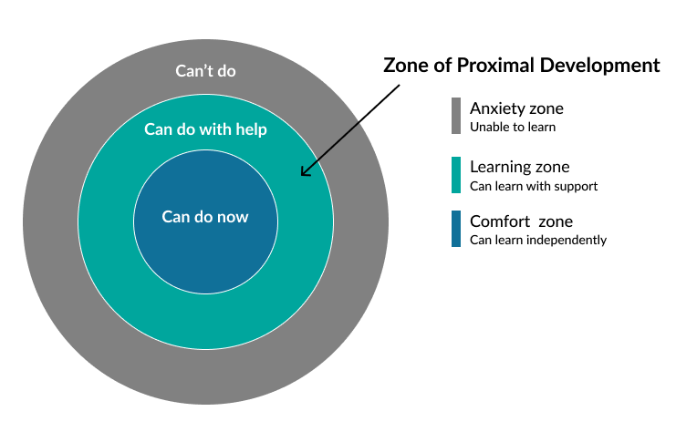

# Learning Goals

The first step to developing a software project is to make sure everyone agrees
on the project objectives. For class projects, an important objectives to
discuss what everyone wants to learn from these exercises.

There are no wrong answers, it's ok if everyone has different objectives! Shat's
important is that everyone has the same expectations.

## The Zone of Proximal Development

The _Zone of Proximal Development (ZPD)_ is a helpful model for writing your learning goals.  Productive learning goals will be in your personal _learning zone_, skills that are not easy for you but you can master in the time you have with the support you have available.   

Everyone's ZPD is different!  This is why you have the chance to write both shared and personal learning goals.



## Template File

Here's some markdown you can copy-paste into `/planning/learning-goals.md` to get started:

```markdown
# Learning Goals

## Shared Learning Goals

## Individual Learning Goals

### Person 1

### Person 2

...

```